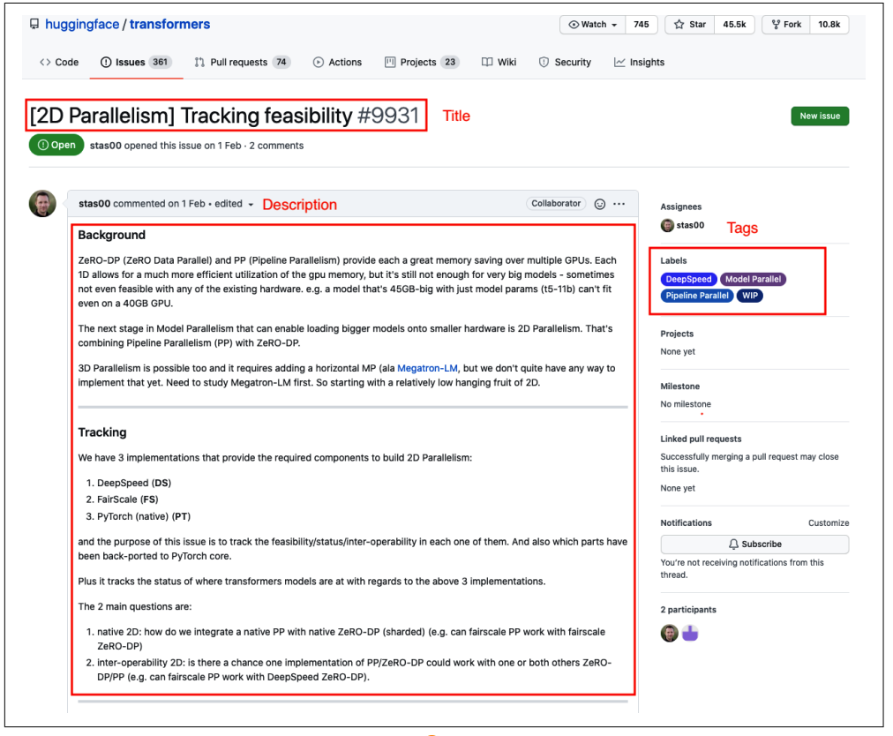
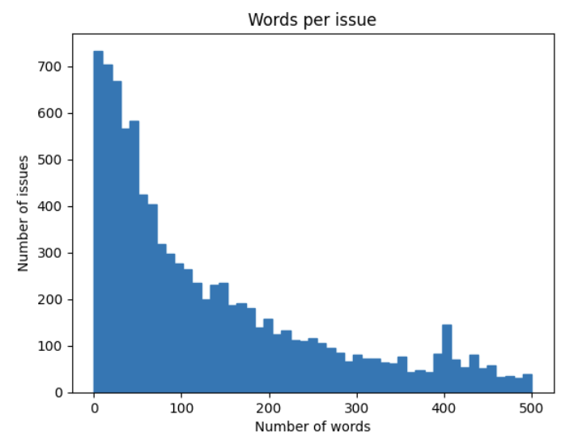
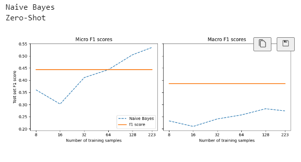
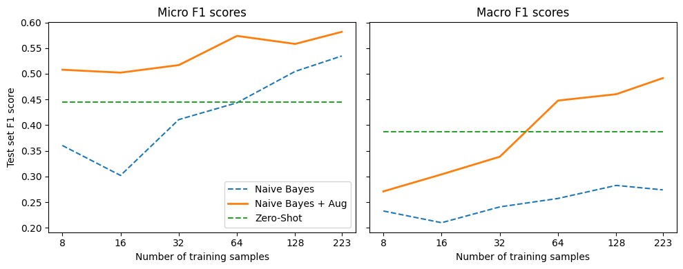
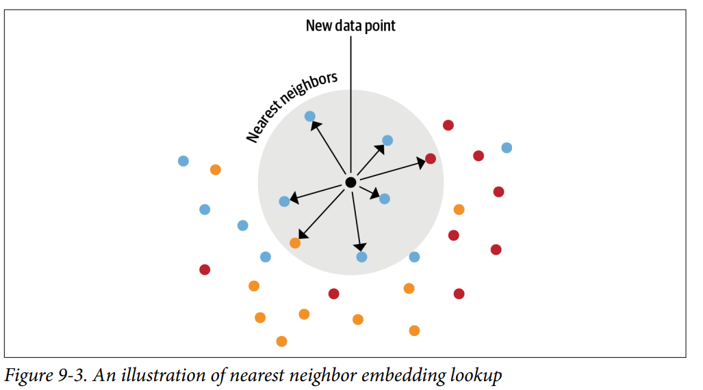
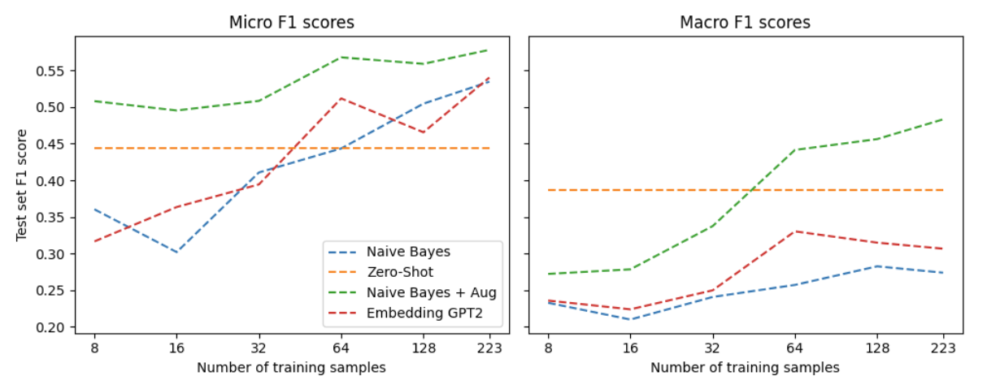
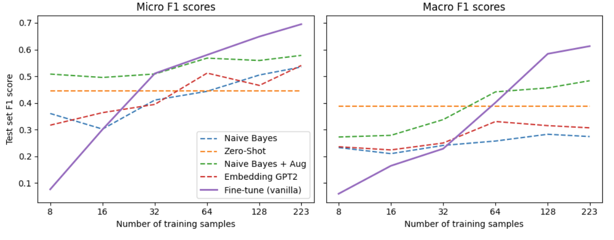
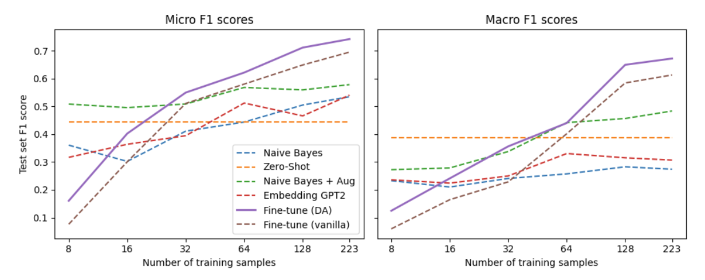

# use issue trackers like Jira or GitHub to assist users: 
## tagging issues with metadata based on the issue’s description. 
Thesetags might define the issue type, the product causing the problem, or which team is
responsible for handling the reported issue. Automating this process can have a big
impact on productivity and enables the support teams to focus on helping their users.

# Step 1 Get and process the data 
To grab all the repository’s issues, we’ll use the GitHub REST API to poll the Issues
endpoint.

Create training and test set  
# Step 2: Use simple Naive base model to benchmarch
# step 3: Use MNLI model for zero shot task 
benchmark with topk and threshold methologies and compare with the naive base

We can see 
Naive base model work better when we have more data
And if have less than 50 sample MNLI model work better 

# Approach 2 If we have some data 
## Use data augmentation
test with substitute augment in with nlpaug lib
create training and test dataset

data augmentation work like charm when augment 10 sample

# Approach 3 use Embeddings as a Lookup 
Use model GPT2 to create embedding dictionary 
Use Faiss API to create index and search
 
  
This method have good results when dont have much data don't want to find tune the model it can yield quick result
# Approach 4 fine tune data 
Use bert base model to fine tune data
  
Can see fine-tune model work better when have more data accuracy grow exponentially
# Approach 5 use unlabeled data to fine tune with domain adaptation
